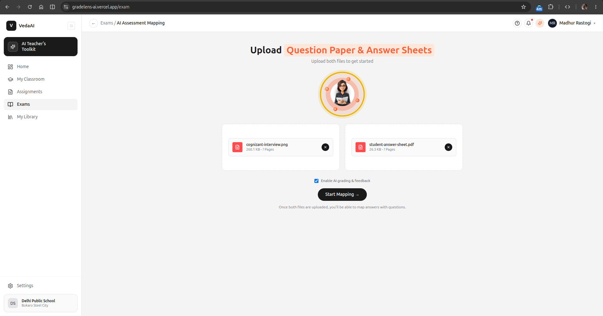
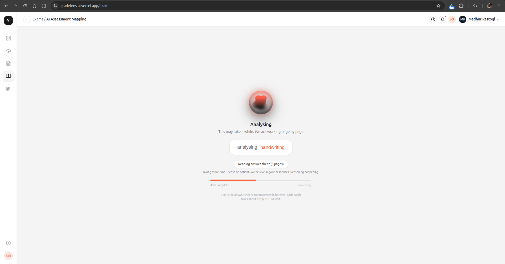
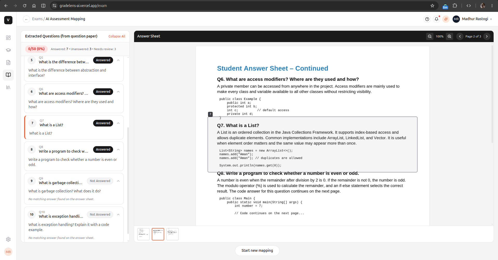

# GradeLens AI - Assessment Extraction and Answer Mapping

> AI powered assessment intelligence that extracts questions, transcribes handwriting, maps each answer to its question and highlights the exact region on the answer sheet.

[](https://gradelens-ai.vercel.app)
[](https://nextjs.org)
[](https://console.groq.com)

**Live URL:** https://gradelens-ai.vercel.app  
**Figma Reference:** [VedaAI Hiring Assignment](https://www.figma.com/design/GEjt1rt1s7AXvkcr4t8muE/VedaAI-Hiring-Assignment?node-id=1-10442)

---

## Overview

GradeLens AI automates the tedious flipping between a printed question paper and a handwritten answer sheet. Teachers upload both PDFs, the system reads them, figures out which passage answers which question, and lets you click any question to jump to its exact highlight on the scanned sheet. Optional AI grading adds scores, verdicts and concise feedback.

**Core flow:** Upload (question paper + answer sheet) -> Question Extraction -> Answer Extraction -> Answer Mapping -> Grading and Feedback -> Review UI

---

## Features

- **Client side PDF rasterization** - `pdfjs-dist` renders PDFs to `canvas` to JPEG data URLs. Server never touches raw PDFs, so serverless functions stay stable.
- **Stateless API routes** - `/api/extract-questions`, `/api/extract-answers`, `/api/map`, `/api/grade` are pure functions. Images and JSON in, structured JSON out. No database or session.
- **Groq vision** - `qwen/qwen3.6-27b` for all vision calls, batched at 2 images per request to stay under 8K TPM. Each image is 2048 tokens, serialized through a 2100 ms rate limiter with 429 and 413 retry handling.
- **Deterministic mapping** - exact normalized key match, then Levenshtein and confusable substitution with distance up to 1, then text only LLM escalation for ambiguous labels, then unmatched bucket. Multi page answers are grouped in page order.
- **Review UI** - split left question list and right answer sheet viewer with click to highlight. Highlights use normalized 0 to 1 boxes as CSS percentages, so they stay accurate at any zoom. Mobile uses tab switching with shared state.
- **In memory store** - Zustand holds a single `AssessmentResult` for the session. No persistence, as required by the assignment.

---

## Live Demo

**Production:** https://gradelens-ai.vercel.app

- Upload a 2 page question paper and a 4 to 6 page answer sheet to see end to end flow in about 40 to 90 seconds.
- With no `GROQ_API_KEY` the app runs in mock demo mode with synthetic questions and highlights, so the UI is testable without credentials.

---

## Screenshots

Images are stored in `public/screenshots/` and are served as static assets. GitHub renders them via the repo relative path.

| Upload | Processing | Review |
|---|---|---|
|  |  |  |
| Upload question paper and answer sheet. Drag and drop or choose file. Max 10MB per file. | Staged progress with per page messages, spinners and throughput aware waiting. | Extracted questions on left, answer sheet on right. Click to highlight, zoom, paginate, see AI feedback. |

---

## Demo Videos

Videos are in `public/` so they are accessible directly. Add your files to `public/videos/` or keep them in `docs/videos/` and link correctly.

- **Full walkthrough (2 min):** `public/videos/gradelens-demo.mp4` - Upload to review to grading.

Example embed:

```md
[](https://your-loom-link)
```

---

## AI Model and API

- **Provider:** Groq API
- **Model:** `qwen/qwen3.6-27b` for vision and small text calls. Also handles plain text, so grading and mapping escalation reuse the same model. No second model config is needed.
- **Settings:** `temperature: 0`, `response_format: { type: "json_object" }`, `reasoning_effort: "none"` for deterministic JSON.
- **Free tier limits:** 30 RPM, 1000 RPD, 8000 TPM, 200000 TPD, 5 images per request and batched at 2. Each image is 2048 input tokens.
- **Batching:** Question and answer extraction chunk pages by 1 image per request to stay under 8000 tokens per request with 4096 max tokens. Large documents wait for TPM reset via `retry-after` handling.

---

## Tech Stack

- **Framework:** Next.js 14 App Router and TypeScript
- **Styling:** Tailwind CSS and shadcn/ui primitives
- **State:** Zustand
- **Validation:** Zod
- **PDF:** pdfjs-dist
- **AI SDK:** groq-sdk
- **Icons:** lucide-react
- **Deploy:** Vercel

---

## Setup and Run

```bash
# 1. Clone and install
git clone https://github.com/Kaushalendra-Marcus/GradeLens-AI
cd "GradeLens-AI"
npm install

# 2. Configure env (required for real AI, without it app runs in mock demo mode)
cp .env.local.example .env.local
# Edit .env.local and set:
# GROQ_API_KEY=your_groq_key_here
# Optional: GROQ_MODEL=qwen/qwen3.6-27b

# 3. Dev
npm run dev        # http://localhost:3000 redirects to /exam

# 4. Build and start
npm run build
npm start

# 5. Test
npm test           # Vitest runs normalize, matcher, rate limiter and LLM escalation tests
```

**Deploy to Vercel:**

- Push to GitHub and import in Vercel.
- Add `GROQ_API_KEY` as encrypted env var. It is only read inside `app/api/*` routes.
- No extra config is needed. API routes use `maxDuration 120` for long TPM waits.

---

## Project Structure

```
app/
  exam/page.tsx                # Upload -> Processing -> Review orchestrator
  api/extract-questions/route.ts
  api/extract-answers/route.ts
  api/map/route.ts             # deterministic + LLM escalation
  api/grade/route.ts
  home/page.tsx                # Dashboard landing
components/
  layout/AppSidebar.tsx        # VedaAI shell, responsive, active states
  layout/AppHeader.tsx         # Breadcrumb and actions, mobile drawer
  upload/UploadDropzone.tsx    # Figma dashed upload, file inside box
  upload/TeacherAvatarBadge.tsx# Peach rings with teacher illustration
  processing/ProcessingView.tsx# Spinners and staged progress
  review/QuestionListPanel.tsx # Accordion list with expand and collapse
  review/AnswerSheetPanel.tsx  # Zoom, pagination, highlight overlay
lib/
  groq/client.ts               # Groq client, rate limiter, reasoning none
  groq/rateLimiter.ts
  extraction/prompts.ts        # Tight bbox prompts
  extraction/questionExtraction.ts
  extraction/answerExtraction.ts
  mapping/normalize.ts
  mapping/matcher.ts
  mapping/llmEscalation.ts
types/domain.ts
store/useAssessmentStore.ts
docs/SPEC.md
docs/IMPLEMENTATION.md
```

See `docs/SPEC.md` for product spec and `docs/IMPLEMENTATION.md` for stack, prompts and algorithms.

---


## Known Limitations

- Handwriting OCR accuracy depends on scan quality and the vision model's handwriting capability. There is no fallback OCR engine due to free tier constraints.
- Free tier throughput caps large documents. Serialized batching takes longer for 10 plus pages.
- No persistence. Closing the tab loses the session.
- Mock mode when `GROQ_API_KEY` is unset returns synthetic demo data.

---
